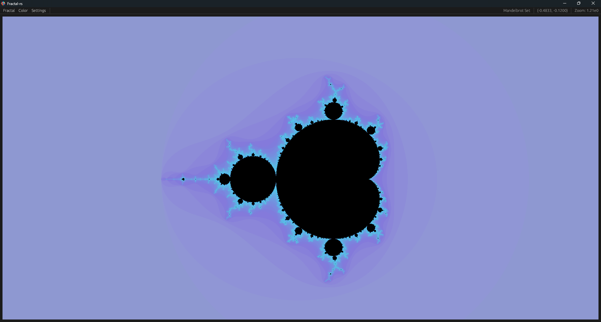
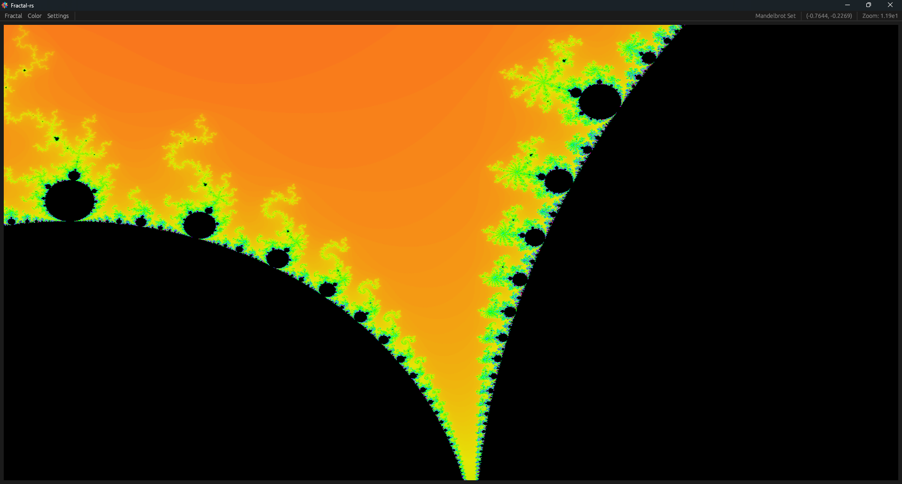
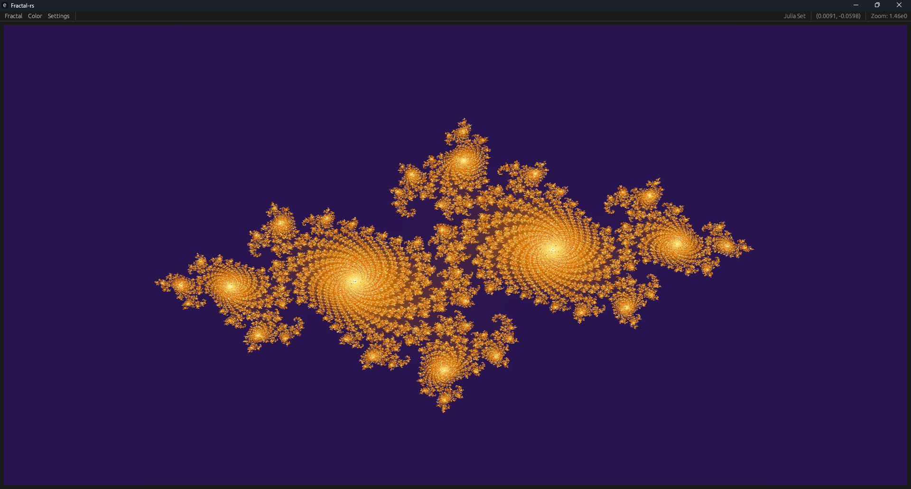
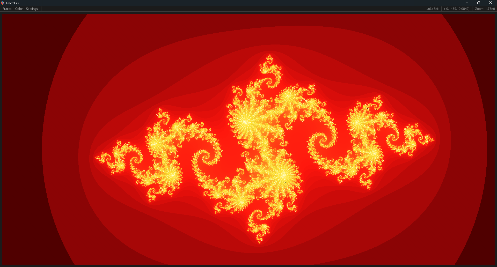
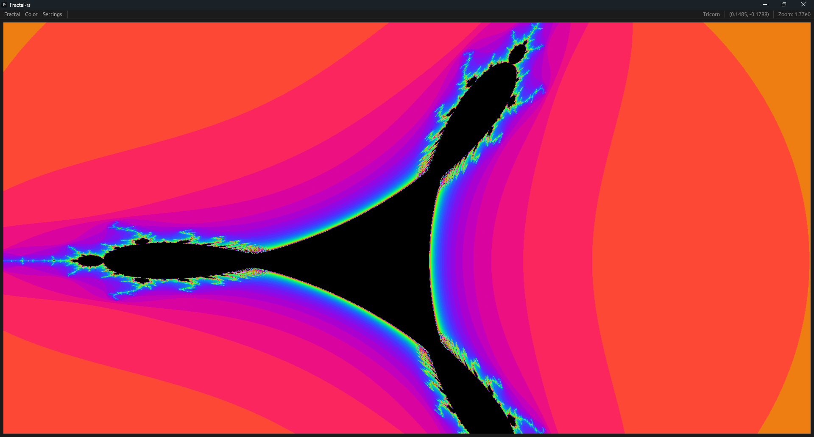
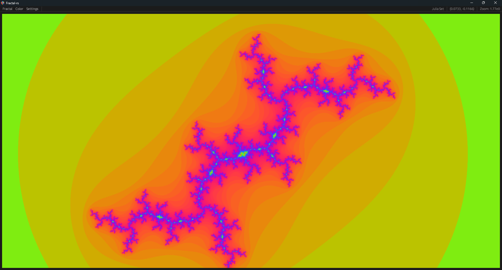
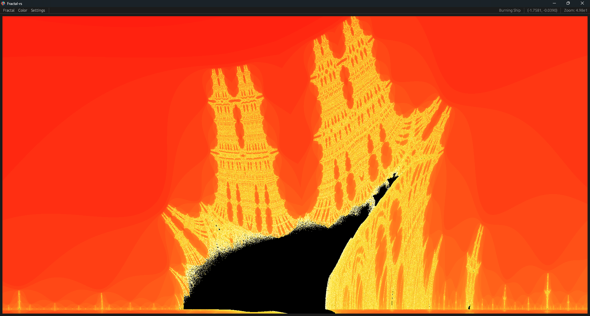
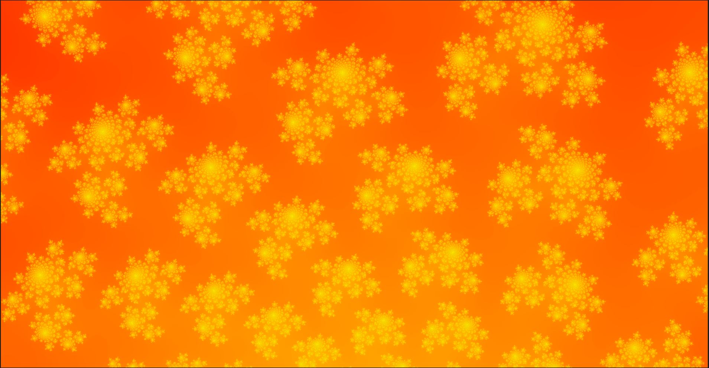

<div align="center">
    <h1>Fractal Explorer</h1>
</div>

<div align="center">
    
    
</div>


<p align="center">
  
  
  
  
  
  
  
  
</p>

## 📖 Overview

A high-performance fractal renderer built in Rust with an interactive GUI for exploring the beautiful world of
mathematical fractals including the Mandelbrot set, Julia sets, and more.

## ✨ Key Features

- **Real-time Fractal Rendering**: Smooth, interactive exploration of fractals
- **Multiple Fractal Types**:
    - Mandelbrot Set
    - Julia Sets (with customizable parameters)
    - Burning Ship
    - Newton's Fractal
    - Tricorn (Mandelbar)
- **Interactive GUI**:
    - Zoom and pan with mouse controls
    - Real-time parameter adjustment
    - Color palette customization
- **High Performance**: Multi-threaded rendering
- **Precision Control**: Adjustable precision between float32, float64 and float128

## 💻 Platform Support

<div align="center">
  <a href="#macos">
    
  </a>
  <a href="#linux">
    
  </a>
  <a href="#windows">  
    
  </a>
</div>

## 📋 Prerequisites

- **Rust Compiler** (Install via [Rustup](https://rustup.rs/))
- **Cargo Package Manager** (Installed with Rust)

## 🚀 Getting Started

### 1. Clone the Repository

```bash
git clone https://github.com/Maxime-Cllt/Fractals-rs.git
```

### 2. Build and Run

```bash
cargo run --release
```

### Float 128 Support

To enable float128 features :

```bash
cargo run --release --features f128
```

## 📦 Download Pre-built Binaries

Pre-built binaries are available for each release in **two variants**:

### Standard Version
- **File naming**: `Fractals-rs-{platform}`
- **Features**: f32 and f64 precision modes
- **Performance**: Faster rendering, smaller file size
- **Use case**: General fractal exploration with excellent quality
- **Recommended for**: Most users

### F128 Version (Ultra-High Precision)
- **File naming**: `Fractals-rs-{platform}-f128`
- **Features**: f32, f64, and **f128** (128-bit decimal) precision modes
- **Performance**: Slower rendering, larger file size
- **Use case**: Extreme zoom levels (beyond 10^15) requiring maximum precision
- **Recommended for**: Advanced users, deep zoom enthusiasts, scientific visualization

### Which version should I choose?

- **Standard**: Perfect for 99% of use cases. Supports zooms up to 10^15 with excellent quality.
- **F128**: Only needed for extreme deep zooms beyond standard floating-point limits. Provides arbitrary precision at the cost of performance.

### Platform Downloads

The release artifacts follow this naming convention:
- Windows x64: `Fractals-rs-x86_64-pc-windows-msvc.exe` (standard) / `Fractals-rs-x86_64-pc-windows-msvc-f128.exe` (f128)
- Windows ARM64: `Fractals-rs-aarch64-pc-windows-msvc.exe` (standard) / `Fractals-rs-aarch64-pc-windows-msvc-f128.exe` (f128)
- macOS Intel: `Fractals-rs-x86_64-apple-darwin` (standard) / `Fractals-rs-x86_64-apple-darwin-f128` (f128)
- macOS Apple Silicon: `Fractals-rs-aarch64-apple-darwin` (standard) / `Fractals-rs-aarch64-apple-darwin-f128` (f128)

## 🧪 Code Quality

### Unit Tests available

To run unit tests, use the following command:

```bash
cargo test
```

### Benchmarks available

Benchmarks use the `criterion` crate for performance testing. To run benchmarks, use:

```bash
cargo bench
```

## 🔗 See Also

- [Fractalium](https://github.com/Maxime-Cllt/Fractalium)

## 🤝 Contributing

Contributions are welcome! To contribute:

- **Fork the Repository**
- **Create a Feature Branch**:
  ```bash
  git checkout -b feature/your-feature-name
    ```

## Acknowledgments

- [Benoit Mandelbrot](https://en.wikipedia.org/wiki/Benoit_Mandelbrot) for his groundbreaking work on fractal geometry
- [The Fractal Geometry of Nature](https://en.wikipedia.org/wiki/The_Fractal_Geometry_of_Nature) for inspiration