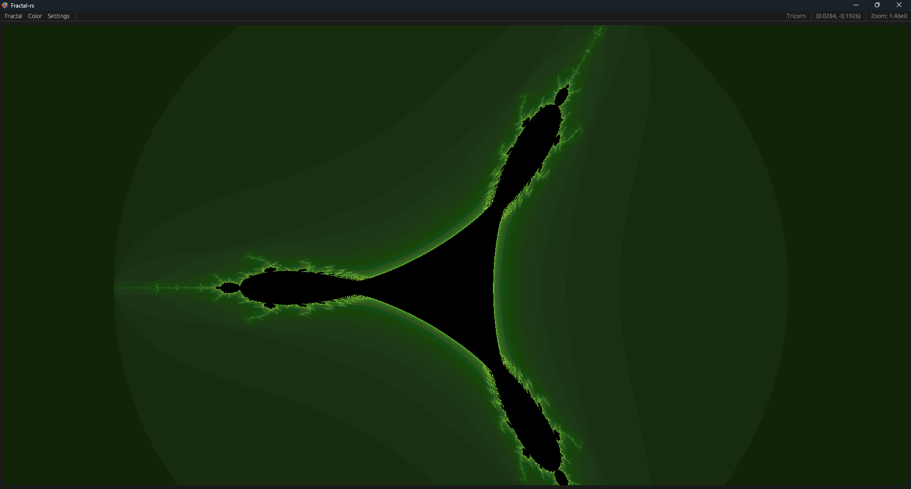

<div align="center">
    <h1>Fractal Explorer</h1>
</div>

<div align="center">
    
    
</div>


<p align="center">
  
  
  
  
  
  
  
</p>

## 📖 Overview

A high-performance fractal renderer built in Rust with an interactive GUI for exploring the beautiful world of
mathematical fractals including the Mandelbrot set, Julia sets, and more.

## ✨ Key Features

- **Real-time Fractal Rendering**: Smooth, interactive exploration of fractals
- **Multiple Fractal Types**:
    - Mandelbrot Set
    - Julia Sets (with customizable parameters)
    - Burning Ship
    - Newton's Fractal
    - Tricorn (Mandelbar)
- **Interactive GUI**:
    - Zoom and pan with mouse controls
    - Real-time parameter adjustment
    - Color palette customization
- **High Performance**: Multi-threaded rendering
- **Precision Control**: Adjustable precision between float64 and float32

## 💻 Platform Support

<div align="center">
  <a href="#macos">
    
  </a>
  <a href="#linux">
    
  </a>
  <a href="#windows">  
    
  </a>
</div>

## 📋 Prerequisites

- **Rust Compiler** (Install via [Rustup](https://rustup.rs/))
- **Cargo Package Manager** (Installed with Rust)

## 🚀 Getting Started

### 1. Clone the Repository

```bash
git clone https://github.com/Maxime-Cllt/Fractals-rs.git
```

### 2. Build and Run

```bash
cargo run --release
```

## 🧪 Code Quality

### Unit Tests available

To run unit tests, use the following command:

```bash
cargo test
```

### Benchmarks available

Benchmarks use the `criterion` crate for performance testing. To run benchmarks, use:

```bash
cargo bench
```

## 🔗 See Also

- [Fractalium](https://github.com/Maxime-Cllt/Fractalium)

## 🤝 Contributing

Contributions are welcome! To contribute:

- **Fork the Repository**
- **Create a Feature Branch**:
  ```bash
  git checkout -b feature/your-feature-name
    ```

## Acknowledgments

- [Benoit Mandelbrot](https://en.wikipedia.org/wiki/Benoit_Mandelbrot) for his groundbreaking work on fractal geometry
- [The Fractal Geometry of Nature](https://en.wikipedia.org/wiki/The_Fractal_Geometry_of_Nature) for inspiration